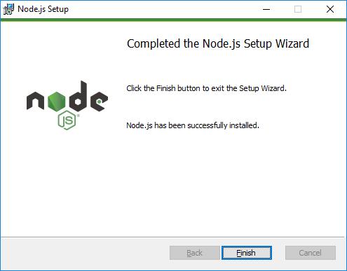
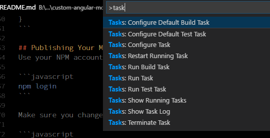

# Custom Angular Modules
A repository of resources for creating shareable custom angular modules. Includes presentation collateral, source code, and guides.

## Setup
The following section outlines the tools that will be used to develop our custom angular modules. 

### Visual Studio Code
Visual Studio Code is a lightweight but powerful source code editor which runs on your desktop and is available for Windows, macOS and Linux. It comes with built-in support for JavaScript, TypeScript and Node.js and has a rich ecosystem of extensions for other languages (such as C++, C#, Java, Python, PHP, Go) and runtimes (such as .NET and Unity). Begin your journey with VS Code with these introductory videos.

* [https://code.visualstudio.com/download](https://code.visualstudio.com/download)

Visual Studio Code also has many extensions that can be downloaded to customize your development environment and experience. 

* [Debugger for Chrome](https://marketplace.visualstudio.com/items?itemName=msjsdiag.debugger-for-chrome)
* [TSLint](https://marketplace.visualstudio.com/items?itemName=eg2.tslint)

### Node.js and NPM
Download and install node.js. We will use ` npm ` to install packages/libraries from the npm public repository. 

* [https://nodejs.org/en/download/](https://nodejs.org/en/download/)



## Angular-CLI install
We will use the Angular CLI tool to generate module items. The CLI tool will create/scaffold modules, services, classes, components and more. It also can be used to compile our application. It can be used to setup new web projects (full and lightweight). 

```javascript
npm install -g @angular/cli@latest
```

## Typescript Install
We will use the latest compatible version of Typescript. 

```javascript
npm install -g typescript@'>=2.4.2 <2.5.0'
```

## Setup
Now that we have the basic tools installed we are ready to create a new custom angular module. We will need a new folder to build out the new custom module.

Create a ` simple-logger ` folder on your computer. 

```javascript
mkdir simple-logger
```

Since we will take advantage of the ` angular-cli ` tool we need to add (2) folders to support the tooling and folder conventions of the CLI.

Create the following folder structure in the root of the project. 

```javascript
src\app
```


### package.json
Use the the npm command to create a new package.json file for the new project. This file will be used to define our module dependencies. 

```javascript
npm init
```

The default contents of the ` package.json ` file is:

```javascript
{
  "name": "simple-logger",
  "version": "1.0.0",
  "description": "A simple logger module for Angular applications.",
  "main": "index.js",
  "scripts": {
    "test": "echo \"Error: no test specified\" && exit 1"
  },
  "keywords": [
    "angular",
    "custom",
    "module",
    "logging"
  ],
  "author": "Matt Vaughn",
  "license": "MIT"
}
```

Update the ` scripts ` section to include the following.

```javascript
"transpile": "ngc",
"build": "npm run transpile"
```

The current ` package.json ` file does not have any ` devDependencies ` or ` Dependencies `. We will need to either update the file or use the ` npm ` command to add the packages to our module project. 

Run the following in the terminal to add the ` devDependencies ` to the project. Note: you might have to be running Visual Studio Code in Administrator.

```javascript
npm install --save-dev @angular/cli@latest
npm install --save-dev @angular/common@latest
npm install --save-dev @angular/compiler@latest
npm install --save-dev @angular/core@latest
npm install --save-dev @angular/compiler-cli@latest
npm install --save-dev typescript@'>=2.4.2 <2.5.0'
```

The npm install ' --save-dev ` will update the ` devDependencies ` section in the ` package.json ` file. 

```javascript
"devDependencies": {
    "@angular/cli": "^1.5.0",
    "@angular/common": "^5.0.1",
    "@angular/compiler": "^5.0.1",
    "@angular/compiler-cli": "^5.0.1",
    "@angular/core": "^5.0.1",
    "typescript": "^2.4.2"
  }
```

### tsconfig.json
Use the Typescript command to create a ` tsconfig.json ` file for the application. The configuration information in this file will be used to compile the Typescript. 

```javascript
tsc --init
```

The default output of the ` tsc --init ` is below. WE can customize the configuration. I like that there are comments that describe the usage of the different options. 

```javascript
{
  "compilerOptions": {
    /* Basic Options */
    "target": "es5",                          /* Specify ECMAScript target version: 'ES3' (default), 'ES5', 'ES2015', 'ES2016', 'ES2017', or 'ESNEXT'. */
    "module": "commonjs",                     /* Specify module code generation: 'commonjs', 'amd', 'system', 'umd', 'es2015', or 'ESNext'. */
    // "lib": [],                             /* Specify library files to be included in the compilation:  */
    // "allowJs": true,                       /* Allow javascript files to be compiled. */
    // "checkJs": true,                       /* Report errors in .js files. */
    // "jsx": "preserve",                     /* Specify JSX code generation: 'preserve', 'react-native', or 'react'. */
    // "declaration": true,                   /* Generates corresponding '.d.ts' file. */
    // "sourceMap": true,                     /* Generates corresponding '.map' file. */
    // "outFile": "./",                       /* Concatenate and emit output to single file. */
    // "outDir": "./",                        /* Redirect output structure to the directory. */
    // "rootDir": "./",                       /* Specify the root directory of input files. Use to control the output directory structure with --outDir. */
    // "removeComments": true,                /* Do not emit comments to output. */
    // "noEmit": true,                        /* Do not emit outputs. */
    // "importHelpers": true,                 /* Import emit helpers from 'tslib'. */
    // "downlevelIteration": true,            /* Provide full support for iterables in 'for-of', spread, and destructuring when targeting 'ES5' or 'ES3'. */
    // "isolatedModules": true,               /* Transpile each file as a separate module (similar to 'ts.transpileModule'). */

    /* Strict Type-Checking Options */
    "strict": true                            /* Enable all strict type-checking options. */
    // "noImplicitAny": true,                 /* Raise error on expressions and declarations with an implied 'any' type. */
    // "strictNullChecks": true,              /* Enable strict null checks. */
    // "noImplicitThis": true,                /* Raise error on 'this' expressions with an implied 'any' type. */
    // "alwaysStrict": true,                  /* Parse in strict mode and emit "use strict" for each source file. */

    /* Additional Checks */
    // "noUnusedLocals": true,                /* Report errors on unused locals. */
    // "noUnusedParameters": true,            /* Report errors on unused parameters. */
    // "noImplicitReturns": true,             /* Report error when not all code paths in function return a value. */
    // "noFallthroughCasesInSwitch": true,    /* Report errors for fallthrough cases in switch statement. */

    /* Module Resolution Options */
    // "moduleResolution": "node",            /* Specify module resolution strategy: 'node' (Node.js) or 'classic' (TypeScript pre-1.6). */
    // "baseUrl": "./",                       /* Base directory to resolve non-absolute module names. */
    // "paths": {},                           /* A series of entries which re-map imports to lookup locations relative to the 'baseUrl'. */
    // "rootDirs": [],                        /* List of root folders whose combined content represents the structure of the project at runtime. */
    // "typeRoots": [],                       /* List of folders to include type definitions from. */
    // "types": [],                           /* Type declaration files to be included in compilation. */
    // "allowSyntheticDefaultImports": true,  /* Allow default imports from modules with no default export. This does not affect code emit, just typechecking. */

    /* Source Map Options */
    // "sourceRoot": "./",                    /* Specify the location where debugger should locate TypeScript files instead of source locations. */
    // "mapRoot": "./",                       /* Specify the location where debugger should locate map files instead of generated locations. */
    // "inlineSourceMap": true,               /* Emit a single file with source maps instead of having a separate file. */
    // "inlineSources": true,                 /* Emit the source alongside the sourcemaps within a single file; requires '--inlineSourceMap' or '--sourceMap' to be set. */

    /* Experimental Options */
    // "experimentalDecorators": true,        /* Enables experimental support for ES7 decorators. */
    // "emitDecoratorMetadata": true,         /* Enables experimental support for emitting type metadata for decorators. */
  }
}
```

We will now modify the ` tsconfig.json ` file. Note that the ` rootDir ` item is set to ` src/app ` - this is to support using the ` angular-cli ` tool. The ` paths ` option is to allow the compiler to access the ` dependencies ` of the module.

More information about compiler options: [https://www.typescriptlang.org/docs/handbook/compiler-options.html](https://www.typescriptlang.org/docs/handbook/compiler-options.html)

```javascript
"baseUrl": "./"
"declaration": true
"experimentalDecorators": true
"inlineSourceMap": true
"inlineSources": true
"lib": ["es2015","dom"]
"module": "es2015"
"moduleResolution": "node"
"noImplicitAny": true
"outDir": "dist"
"paths": {"@angular/core": ["node_modules/@angular/core/*"]}
"rootDir": "src/app"
"sourceMap": true
"strictNullChecks": true
```

The following items were added to the the ` compilerOptions ` section. 

* "stripInternal": true
* "skipLibCheck": true

Add the following new sections to the the ` tsconfig.json ` file. These items are not part of the ` compilerOptions ` section.

```javascript
"files": [
    "./src/app/index.ts"
],
"angularCompilerOptions": {
    "strictMetadataEmit": true,
    "genDir": "aot-dist"
}
```

The final configuration for ` tsconfig.json `

```javascript
{
  "compilerOptions": {
    /* Basic Options */
    "target": "es5", /* Specify ECMAScript target version: 'ES3' (default), 'ES5', 'ES2015', 'ES2016', 'ES2017', or 'ESNEXT'. */
    "module": "es2015", /* Specify module code generation: 'commonjs', 'amd', 'system', 'umd', 'es2015', or 'ESNext'. */
    "lib": [
      "es2015",
      "dom"
    ],
    /* Specify library files to be included in the compilation:  */
    "declaration": true, /* Generates corresponding '.d.ts' file. */
    "sourceMap": true, /* Generates corresponding '.map' file. */
    "outDir": "dist", /* Redirect output structure to the directory. */
    "rootDir": "src/app", /* Specify the root directory of input files. Use to control the output directory structure with --outDir. */
    "skipLibCheck": true,
    /* Strict Type-Checking Options */
    "strict": true, /* Enable all strict type-checking options. */
    "noImplicitAny": true, /* Raise error on expressions and declarations with an implied 'any' type. */
    "strictNullChecks": true, /* Enable strict null checks. */
    "stripInternal": true,
    /* Module Resolution Options */
    "moduleResolution": "node", /* Specify module resolution strategy: 'node' (Node.js) or 'classic' (TypeScript pre-1.6). */
    "baseUrl": "./", /* Base directory to resolve non-absolute module names. */
    "paths": {
      "@angular/core": [
        "node_modules/@angular/core/*"
      ]
    },
    /* Source Map Options */
    "inlineSources": true, /* Emit the source alongside the sourcemaps within a single file; requires '--inlineSourceMap' or '--sourceMap' to be set. */
    /* Experimental Options */
    "experimentalDecorators": true /* Enables experimental support for ES7 decorators. */
  },
  "files": [
    "./src/app/index.ts"
  ],
  "angularCompilerOptions": {
    "strictMetadataEmit": true,
    "genDir": "aot-dist"
  }
}
```

### angular-cli.json
Since we want to take advantage of the Angular CLI tool, we'll need to add a ` angular-cli.json ` configuration file to the root of the project. Use the following content as a template for the configuration.

```javascript
{
    "project": {
        "version": "1.0.0",
        "name": "simple-logger"
    },
    "apps": [
        {
            "tsconfig": "tsconfig.json",
            "mobile": false,
            "root": "src",
            "prefix": "app"
        }
    ],
    "defaults": {
        "styleExt": "css",
        "prefixInterfaces": false,
        "lazyRoutePrefix": "+"
    }
}
```

### index.ts
This file is really the most important element of the solution. It will allow you to publicly expose (can I say that in technical documentation?) or allow clients to find the specified module of the package - which is very important to Angular applications.

The only project member we need to expose is the module itself. The module will actually define what elements of the module are publicly visible - more on that later.

Add a new file ` index.ts ` in the ` app ` folder. This file will be used to reference the items in the module.

```javascript
ng generate module simpleLogger
```

### SimpleLoggerModule
We are not ready to add the ` @NgModule ` to the project. We can use the CLI to do this. Use the following command to add an Angular module to the project. 

```javascript
ng generate module simpleLogger
```

Add an ` export ` statement to the ` index.ts ` file to reference the new module. 

```javascript
export * from './simple-logger/simple-logger.module';
```

We are now ready to build the module project.

```javascript
.\node_modules\.bin\ngc .\tsconfig.json
```

The ` dist ` folder will be created (as indicated in our ` outDir ` setting in the ` tsconfig.json `) - with the output of the ` ngc ` compile operation.


### SimpleLoggerService
Use the Angular CLI to create a service for the module. 

```
ng generate service simple-logger\simpleLogger
```

The CLI creates a service class with the ` @Injectable ` decorator. 

**simple-logger.service.ts**
```javascript
import { Injectable } from '@angular/core';

@Injectable()
export class SimpleLoggerService {
  constructor() { }
}
```

Since we have a new member of the module, we can add it to the ` index.ts ` file.

```javascript
export * from './simple-logger/simple-logger.service';
```

Run the build command to create the ` index.js ` file in the ` dist ` folder. 

```javascript
.\node_modules\.bin\ngc .\tsconfig.json
```

```
export * from './simple-logger/simple-logger.module';
export * from './simple-logger/simple-logger.service';
//# sourceMappingURL=index.js.map
```

### Severity Enum,
We will now create a new member of the module. Remember to add the item to the ` index.ts ` file.

```javascript
ng generate enum simple-logger\severity
```

The output of the CLI operation is:

```
export enum Severity {
}
```

Add some enum options.

```javascript
export enum Severity {
    Information = 1,
    Warning = 2,
    Error = 3,
    Critical = 4,
    Debug = 5
}
```

### Add A Module Feature
Now that we have a service, we can add some functionality to make it more useful. 

```javascript
import { Injectable } from '@angular/core';
import { Severity } from './severity.enum';

@Injectable()
export class SimpleLoggerService {

  private source: string;
  private severity: Severity;
  private message: string;
  private timestamp: Date;

  constructor() { }

  /**
   * Use to create a log item in the application console.
   * @param source 
   * @param severity 
   * @param message 
   */
  log(source: string, severity: Severity, message: string) {
    this.source = source;
    this.severity = severity;
    this.message = message;
    this.timestamp = new Date();
    const msg = `${this.message}`;

    console.log(`${this.severity} from ${this.source}: ${msg} (${this.timestamp})`);
  }
}
```

### Dist Package.json Configuration
In order to publish the module, we will need to provide some information to the ` output` of the build process. The ` dist ` folder needs a ` package.json ` file with some similar configuration - but with a slight change to the dependency section. 

Notice, this ` package.json ` does NOT have a ` devDependencies ` or ` dependencies ` section. Normally, you wouldn't save the contents of your ` dist ` to your code repository. However, if you are publishing your module to an NPM repository, you will publish the contents of the ` dist ` folder. Therefore, I think it is reasonable to save the contents to your code repository. 

```
{
    "name": "custom-angular-modules",
    "version": "1.0.0",
    "description": "An Angular custom module that contains foundation elements for buildmotion Angular applications. Basically, the framework for buildmotion NG.",
    "main": "index.js",
    "typings": "index.d.ts",
    "repository": {
        "type": "git",
        "url": "https://github.com/buildmotion/custom-angular-modules"
    },
    "keywords": [
        "angular",
        "custom",
        "module",
        "logging"
    ],
    "author": {
        "name": "Matt Vaughn",
        "email": "matt.vaughn@buildmotion.com",
        "url": "http://www.buildmotion.com"
    },
    "license": "MIT",
    "bugs": {
        "url": "https://github.com/buildmotion/custom-angular-modules/issues"
    },
    "homepage": "https://github.com/buildmotion/custom-angular-modules#readme",
    "peerDependencies": {
        "@angular/common": "^5.0.1",
        "@angular/core": "^5.0.1"
    }
}
```

## Publishing Your Module to NPM
Use your NPM account credentials and publish the module to NPM.

```javascript
npm login
```

Make sure you change your directory to the ` dist ` folder before you publish to NPM.

```javascript
cd .\dist\
npm version patch
npm publish
```

## Default Build Task Configuration
So far, we have been using the command below to build the project. 

```
.\node_modules\.bin\ngc .\tsconfig.json
```

Use the command below to select the ` Tasks: Configure Default Build Task ` item from the list. Select the ` npm: Build ` option.
```
Ctrl + p
>task
```



A new ` task.json ` configuration file is created in the ` .vscode ` folder in your project. Now that you have configured the default build task, you can use the run the menu ` Tasks | Run Build Task ... ` to build the project. Or, you can use the keyboard short cut: ` Ctrl+Shift+B ` to do the same thing.

```javascript
{
    "tasks": [
        {
            "type": "npm",
            "script": "build",
            "group": {
                "kind": "build",
                "isDefault": true
            }
        }
    ]
}
```

# Using a Custom Module...Business as Usual, Right?

Now that we have a custom angular module, we are ready to use it in one of Angular applications. We created a new web application in a local development folder. Once again, use the Angular CLI to create a new application. 

```javascript
ng new ngAppOne
```

## Using the Module
Since we published the SimpleLoggingModule to NPM, we can use npm to retrieve the package and add the reference in our ` package.json ` file. We use the latest version of the package - in this case it is a ` 1.0.x ` version. Later, we'll update the module to include some enhanced features (version ` 2.0.x`) and use the new version in a different web application. This will demonstrate the process of versioning the module and its usage by different applications. 

The ` 1.0.3 ` version contains the basic feature of just logging to the application's console. This is fine for now, we are demonstrating the end-to-end path of creating a module, publishing the module, and consuming the module in an application. 

```javascript
npm i --save custom-angular-modules@1.0.3
```

When we use the ` --save ` switch, npm will update our ` dependencies ` section of the ` package.json ` file to include our requested package. Notice that the version requested was ` 1.0.3 `, however, npm updated the reference to ` ^1.0.3 `. This 

* More information about  [https://docs.npmjs.com/getting-started/semantic-versioning](https://docs.npmjs.com/getting-started/semantic-versioning)

        Caret ranges are ideal when an author may make breaking changes between 0.2.4 
        and 0.3.0 releases, which is a common practice. However, it presumes that there 
        will not be breaking changes between 0.2.4 and 0.2.5. It allows for changes 
        that are presumed to be additive (but non-breaking), according to commonly 
        observed practices.

```javascript
 "dependencies": {
    "@angular/common": "^2.4.0",
    "@angular/compiler": "^2.4.0",
    "@angular/core": "^2.4.0",
    "@angular/forms": "^2.4.0",
    "@angular/http": "^2.4.0",
    "@angular/platform-browser": "^2.4.0",
    "@angular/platform-browser-dynamic": "^2.4.0",
    "@angular/router": "^3.4.0",
    "core-js": "^2.4.1",
    "custom-angular-modules": "^1.0.3",
    "rxjs": "^5.1.0",
    "zone.js": "^0.7.6"
  }
  ```

### Let's Attempt to Compile

Compile the application. We will now get the following ERROR. Oh no. There is a version mismatch - this is a typical dependency issue that all custom module developers need to be aware of. 

        ERROR in Metadata version mismatch for module ./source/apps/ngAppOne/node_modules/custom-angular-modules/index.d.ts, 
        found version 4, expected 3, resolving symbol AppModule in ./source/apps/ngAppOne/src/app/app.module.ts, 
        resolving symbol AppModule in ./source/apps/ngAppOne/src/app/app.module.ts

We will need to fix this problem by going back to the code of the custom module.  We will need to make sure that we are referencing the correct module dependencies and versions to make sure they are compatible with the consumer of this custom module. Making any changes to the custom module will require us to publish a new version to NPM so that consumers of the module will no longer have the version error as shown above.

After examining the versions in the custom module we see that this module is using version 5 for core common. However, the web application is referencing version 2 of the same modules.  Therefore, if we upgrade the web application to use the latest versions of angular we will be in sync with the custom module that we developed. 

We can upgrade the versions of the angular and CLI modules by running the followign NPM commands. This issue demonstrates the the requirement of managing dependencies and versions for the application and also the custom module under consideration. 

```javascript
npm install --save @angular/common@latest
npm install --save @angular/compiler@latest
npm install --save @angular/core@latest
npm install --save @angular/forms@latest
npm install --save @angular/http@latest
npm install --save @angular/platform-browser@latest
npm install --save @angular/platform-browser-dynamic@latest
npm install --save @angular/router@latest
npm install --save-dev typescript@2.4.2
npm install --save-dev @angular/cli@latest
npm install --save-dev @angular/compiler-cli@latest
```

Let's attempt another compile. A general rule for Angular applications is to use the same version for all @angular modules.

```
> Executing task: npm run build <

> ng-app-one@0.0.0 build B:\development\custom-angular-modules\source\apps\ngAppOne
> ng build

Date: 2017-11-15T21:10:56.800Z
Hash: 813e0fe8dcae8310e61b
Time: 8089ms
chunk {inline} inline.bundle.js, inline.bundle.js.map (inline) 5.83 kB [entry] [rendered]
chunk {main} main.bundle.js, main.bundle.js.map (main) 7.09 kB [initial] [rendered]
chunk {polyfills} polyfills.bundle.js, polyfills.bundle.js.map (polyfills) 185 kB [initial] [rendered]
chunk {styles} styles.bundle.js, styles.bundle.js.map (styles) 11.3 kB [initial] [rendered]
chunk {vendor} vendor.bundle.js, vendor.bundle.js.map (vendor) 2.68 MB [initial] [rendered]
 
Terminal will be reused by tasks, press any key to close it.
```

### Dependencies
There are always dependencies in software applications. Applications will rely on underlying frameworks like .NET, ASP.NET, Angular, jQuery, or others. Your software is in different states over time and so are the ` custom angular modules ` that you develop. Therefore in the stream of time your application will always be evolving and they will have different versions. Also, the modules and packages that you depend on will also evolve over time and will be in different versions as well. 

So as a custom module developer, you will need to target specific versions of dependencies so that consumers of your custom module will be able to use it.  For example, if I am using the latest version of Angular which by the way his version 5 and consumers of your module are using a earlier version you will have an incompatibility problems - as seen in the error above.

One way around this is to use a ` lowest common denominator ` approach when developing a custom module. This will allow users of your custom module to access to all the features of the module and still have the benefit of using a lower version of Typescript or Angular or other dependencies that that they may have. You then have an opportunity to create newer versions of your module with different dependencies.  By doing this,  you allow users of your module to target a specific version that is compatible with their application.

If you are a custom module developer and you are consuming your own modules (i.e., private development environment) then your concern will only be making sure that the dependency versions are aligned and in sync with the application that you develop in. This is much easier. If this is your scenario, you might want to consider purchasing an `NPM ` private repository so that your modules are only available to your development team. 

### Updating the Application Module to use the LoggingModule
Basically, we need to **provide** the ` SimpleLoggerService ` to the application. In our example, we will do this in the ` AppModule `. As your application grows, or if you are building an application of a known size/structure/importance etc., you might consider adding these modules in either ` CoreModule ` or ` SharedModule ` items as determined by their usage and scope. A ` CoreModule ` should only be initialized once in the application - The core module has a special purpose and only a single instance is required. See the slide deck presentation or the video presentations when they're available on [https://angularlicious.teachable.com](https://angularlicious.teachable.com) for a more detailed explanations of when/how you would use Core and Shared modules. 

Import the module and service. The ` custom-angular-modules ` package/module should be installed in the ` node_modules ` directory of the application. If you do not have this folder, you will need to run the ` npm install ` command to create it. 

```
import { SimpleLoggerModule, SimpleLoggerService } from 'custom-angular-modules';
```

Now that we have a reference to the service, we can add it to the ` providers ` list in the ` @NgModule ` declaration section. When we provide the service in the ` AppModule ` it means the scope of the service is global to the entire application. For this type of service, this is exactly what we want. Therefore as a module developer you wouldn't want to provide the service in the custom module that you are developing. You would want the consumer of your module to be able to have control over when and where the ` service ` is provided. So if your custom module is a ` service module ` you would never want to provide that service in the ` @NgModule ` providers declaration. 

After the changes to the ` app.module.ts ` code,  the new ` SimpleLoggerService ` will now be available to other members of the application. 

```javascript
import { BrowserModule } from '@angular/platform-browser';
import { NgModule } from '@angular/core';
import { FormsModule } from '@angular/forms';
import { HttpModule } from '@angular/http';

import { SimpleLoggerModule, SimpleLoggerService } from 'custom-angular-modules';
import { AppComponent } from './app.component';

@NgModule({
  declarations: [
    AppComponent
  ],
  imports: [
    BrowserModule,
    FormsModule,
    HttpModule
  ],
  providers: [
    SimpleLoggerService
  ],
  bootstrap: [AppComponent]
})
export class AppModule { }
```

### Adding Components
Remember that the definition of an angular module is that it is a complainer of closely related things to perform some function or provide features of your application.  Your angular web applicaton has a root module ` AppModule ` - this module can also own components use them to basically compose the features of the application. 

We will add some components to the ` ngAppOne ` application and start using the logging service. Use the following commands to create (3) components.

```
ng g component coltrane
ng g component sanborn
ng g component grover
```

When we use the Angular CLI tool, it not only creates the components but it also adds them to the module.  This is really cool. I think taking advantage of tools like the angular CLI allows developers to be more efficient; and to focus on building amazing applications rather than spending time writing code that can be generated. When we use scaffolding tools like the CLI it also allows us to be more consistent in our implementation of our services, components, and modules. This is a good thing. 

Therefore, I think it is a great idea to become familiar with all of the abilities of the Angular CLI so that you can improve your practice and delivery of applications, and becoming more efficient. Maybe your friends and coworkers will be amazed at the quality of your code and how fast you deliver your applications.  And you might even get a raise, right? 


**app.module.ts**
```javascript
import { BrowserModule } from '@angular/platform-browser';
import { NgModule } from '@angular/core';
import { FormsModule } from '@angular/forms';
import { HttpModule } from '@angular/http';

import { SimpleLoggerModule, SimpleLoggerService } from 'custom-angular-modules';

import { AppComponent } from './app.component';
import { ColtraneComponent } from './coltrane/coltrane.component';
import { SanbornComponent } from './sanborn/sanborn.component';
import { GroverComponent } from './grover/grover.component';

@NgModule({
  declarations: [
    AppComponent,
    ColtraneComponent,
    SanbornComponent,
    GroverComponent
  ],
  imports: [
    BrowserModule,
    FormsModule,
    HttpModule
  ],
  providers: [
    SimpleLoggerService
  ],
  bootstrap: [AppComponent]
})
export class AppModule { }
```


Now that we some compents to view, we will need to provide some routes to the application. We can implement a new module for routing. Once again let's use the Angular CLI to create a module for providing routes to the application. 

```
ng g module appRouting
```


**app-routing.module.ts**
```javascript
import { NgModule } from '@angular/core';
import { CommonModule, } from '@angular/common';
import { BrowserModule } from '@angular/platform-browser';
import { Routes, RouterModule } from '@angular/router';

import { AppComponent } from './../app.component';
import { ColtraneComponent } from './../coltrane/coltrane.component';
import { SanbornComponent } from './../sanborn/sanborn.component';
import { GroverComponent } from './../grover/grover.component';

const routes: Routes = [
  { path: 'home', component: AppComponent },
  { path: '', redirectTo: 'home', pathMatch: 'full' },
  { path: 'coltrane', component: ColtraneComponent },
  { path: 'sanborn', component: SanbornComponent },
  { path: 'grover', component: GroverComponent },
];

@NgModule({
  imports: [
    CommonModule,
    BrowserModule,
    RouterModule.forRoot(routes)
  ],
  exports: [
  ],
})
export class AppRoutingModule { }
```